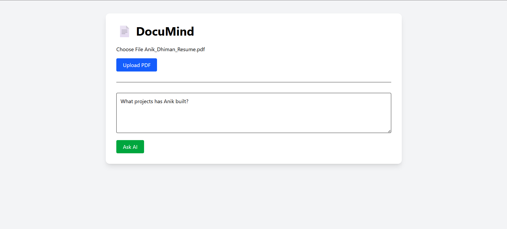

# DocuMind

AI-powered document question answering system built with FastAPI, React, PostgreSQL, LangChain, and Google Gemini.

## Features

- 📄 Upload PDF documents
- 🤖 Ask questions about uploaded documents
- ✂️ Automatic text chunking
- 🧠 AI-powered contextual answers
- 📝 Resume summarization
- ⚡ FastAPI backend + React frontend

## Tech Stack

### Backend
- FastAPI
- SQLAlchemy
- PostgreSQL
- LangChain
- Google Gemini

### Frontend
- React
- Vite
- Axios

## Screenshots



## Run Locally

### Backend

```bash
cd backend
uvicorn main:app --reload