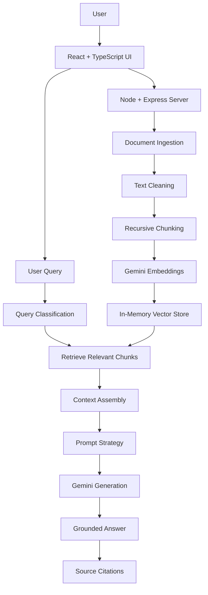
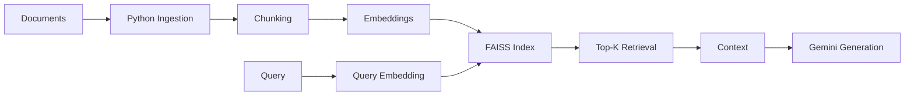

# DocuMind — AI Document Intelligence & RAG

DocuMind is an AI-powered document intelligence workspace that lets users upload documents, ask questions in natural language, and receive grounded answers with source-level traceability.

The project focuses on building a practical Retrieval-Augmented Generation (RAG) system with document ingestion, semantic chunking, vector retrieval, prompt routing, citation tracking, and an interactive UI.

---

## Why DocuMind?

Many document Q&A systems focus only on generating an answer.

DocuMind focuses on **grounded and traceable answers** by connecting generated responses back to the retrieved document context and source metadata.

The system combines:

- Multi-format document ingestion
- Recursive semantic chunking
- Gemini-powered embeddings and generation
- Similarity-based retrieval
- Query-intent-aware prompt routing
- Citation-backed answers
- Source traceability
- FAISS scalability benchmarking
- Interactive document and retrieval inspection

---

## Key Features

### 1. Multi-Format Document Ingestion

Upload and process:

- PDF
- DOCX
- TXT

The application extracts document text, normalizes it, preserves source information, and converts documents into retrievable chunks.

### 2. Semantic Chunking

Documents are split into context-aware chunks using recursive separator priorities.

The default chunking strategy uses:

- Paragraph boundaries
- Line boundaries
- Sentence boundaries
- Word boundaries

Each chunk stores useful traceability metadata such as:

```text
chunk_id
source
page_number
char_start
char_end
token_count
```

This allows retrieved information to be traced back to its original document location.

### 3. Grounded RAG Question Answering

The main application follows a RAG pipeline:

```text
Document
   ↓
Text Extraction
   ↓
Cleaning & Normalization
   ↓
Semantic Chunking
   ↓
Gemini Embeddings
   ↓
Vector Retrieval
   ↓
Relevant Context
   ↓
Prompt Construction
   ↓
Gemini Generation
   ↓
Grounded Answer + Citations
```

The generation layer is instructed to answer strictly from the retrieved document context.

When the available context is insufficient, the system can return a "Not found in document" response instead of intentionally inventing unsupported information.

### 4. Multiple RAG Prompt Strategies

DocuMind supports different prompt strategies based on the user's intent:

1. **Factual Inquiry**  
   Direct answers grounded in the retrieved context.

2. **Summarization / Synthesis**  
   Structured summaries and key takeaways.

3. **Comparative Analysis**  
   Side-by-side comparison of concepts, entities, or metrics.

4. **Structured Extraction**  
   Extraction of dates, numbers, metrics, specifications, and other structured information.

5. **Multi-Hop Reasoning**  
   Combining information from multiple retrieved chunks.

The application can automatically classify the query and select an appropriate strategy.

### 5. Source Traceability

Answers are associated with source metadata using citation tags such as:

```text
[Doc: <source>, Chunk: <chunk_id>, Page: <page_number>]
```

The UI provides a source traceability experience so users can inspect the retrieved evidence behind an answer.

### 6. Interactive Chunk Inspection

The application provides a chunk inspection view for exploring:

- Document chunks
- Chunk metadata
- Retrieval scores
- Source locations
- Vector-related information

This makes the retrieval stage more observable rather than treating it as a black box.

### 7. Retrieval & Scalability Benchmarking

The repository also contains an optional Python/FastAPI + FAISS implementation for retrieval experiments and scalability benchmarking.

Supported FAISS index types include:

- **HNSW** — graph-based approximate nearest-neighbor retrieval
- **IVF** — inverted-file based vector search
- **Flat** — exhaustive exact similarity search

The benchmark tooling allows retrieval behavior to be evaluated at larger vector counts.

> Benchmark results depend on the hardware, dataset, embedding dimensionality, and runtime environment. The repository does not treat a single benchmark run as a universal production SLA.

---

## Architecture

### Main Web Application

The primary application runtime uses React, TypeScript, Node.js, Express, Gemini, and in-memory vector retrieval.


```mermaid
flowchart TD
    A[User] --> B[React + TypeScript UI]

    B --> C[Node + Express Server]

    C --> D[Document Ingestion]
    D --> E[Text Cleaning]
    E --> F[Recursive Chunking]

    F --> G[Gemini Embeddings]
    G --> H[In-Memory Vector Store]

    B --> I[User Query]
    I --> J[Query Classification]
    J --> K[Retrieve Relevant Chunks]

    H --> K
    K --> L[Context Assembly]
    L --> M[Prompt Strategy]
    M --> N[Gemini Generation]

    N --> O[Grounded Answer]
    O --> P[Source Citations]
```

### Optional FAISS Backend

The repository also includes a separate Python implementation for FAISS-based retrieval and scalability experiments:


```mermaid
flowchart LR
    A[Documents] --> B[Python Ingestion]
    B --> C[Chunking]
    C --> D[Embeddings]
    D --> E[FAISS Index]

    Q[Query] --> R[Query Embedding]
    R --> E
    E --> F[Top-K Retrieval]
    F --> G[Context]
    G --> H[Gemini Generation]
```

---

## Tech Stack

| Layer | Technology |
|---|---|
| Frontend | React 19, TypeScript, Vite |
| UI | Tailwind CSS, Lucide React, Motion |
| Backend | Node.js, Express |
| AI / LLM | Google Gemini |
| Embeddings | Gemini Embedding 2 Preview |
| Main Retrieval | In-memory cosine similarity |
| Scalability / Benchmarking | FAISS |
| Optional Backend | Python, FastAPI |
| Document Parsing | PDF, DOCX, TXT |
| PDF Processing | pdf-parse, pdf-lib, pdfkit |
| DOCX Processing | Mammoth |
| Vector Math | Cosine similarity / FAISS |
| Package Management | npm / pip |

---

## Gemini Models

The application is designed around Google's Gemini APIs.

Current model configuration:

```text
Generation:
gemini-3.8-flash

Embeddings:
gemini-embedding-2-preview
```

The Gemini API key is loaded through an environment variable rather than being stored in source code.

---

## Project Structure

```text
DocuMind/
│
├── backend/
│   ├── ingestion.py
│   ├── chunking.py
│   ├── faiss_index.py
│   ├── rag_engine.py
│   ├── main.py
│   ├── build_index.py
│   └── requirements.txt
│
├── public/
│
├── src/
│   ├── components/
│   │   ├── Header.tsx
│   │   ├── DocumentManager.tsx
│   │   ├── ChatInterface.tsx
│   │   ├── SourceTraceabilityPanel.tsx
│   │   ├── ChunkInspector.tsx
│   │   ├── BenchmarkModal.tsx
│   │   └── SettingsDrawer.tsx
│   │
│   ├── types.ts
│   ├── App.tsx
│   ├── main.tsx
│   └── index.css
│
├── server.ts
├── build_index.py
├── generate_pdf.ts
├── index.html
├── metadata.json
├── package.json
├── package-lock.json
├── tsconfig.json
├── vite.config.ts
└── .env.example
```

---

## Getting Started

### Prerequisites

Make sure you have installed:

- Node.js 18+
- npm
- Python 3.10+ (only required for the optional Python / FAISS backend)
- Git

---

## 1. Clone the Repository

```bash
git clone https://github.com/TheAnikDhiman/DocuMInd.git
cd DocuMInd
```

---

## 2. Install Node Dependencies

```bash
npm install
```

---

## 3. Configure Environment Variables

Create a `.env` file in the project root.

You can start from:

```bash
copy .env.example .env
```

On macOS / Linux:

```bash
cp .env.example .env
```

Then add your Gemini API key:

```env
GEMINI_API_KEY=your_gemini_api_key
```

Do not commit `.env` or expose your API key publicly.

---

## 4. Run the Main Application

Start the development server:

```bash
npm run dev
```

Then open:

```text
http://localhost:3000
```

---

## 5. Build for Production

```bash
npm run build
```

Start the production server:

```bash
npm start
```

---

## Optional: Python + FAISS Backend

The Python backend is separate from the primary Node/Express runtime.

Create and activate a virtual environment:

### Windows

```powershell
python -m venv .venv
.venv\Scripts\Activate.ps1
```

### macOS / Linux

```bash
python3 -m venv .venv
source .venv/bin/activate
```

Install Python dependencies:

```bash
pip install -r backend/requirements.txt
```

Start the FastAPI server:

```bash
uvicorn backend.main:app --host 0.0.0.0 --port 8000 --reload
```

---

## FAISS Scalability Benchmark

The repository includes a standalone FAISS benchmark runner.

Example:

```bash
python build_index.py --chunks 10000 --index-type HNSW
```

Available index types:

```text
FLAT
IVF
HNSW
ALL
```

The benchmark measures retrieval latency statistics for the selected test configuration.

---

## API Overview

The Node server exposes endpoints for the main application workflow, including:

```text
GET  /api/health
GET  /api/documents
POST /api/documents/upload
DELETE /api/documents/:id
POST /api/chat/stream
POST /api/benchmark
GET  /api/chunks
GET  /api/chunks/:id
```

The exact API surface may evolve as the project develops.

---

## Retrieval Configuration

The application exposes retrieval-related controls such as:

- Top-K retrieval
- Similarity score threshold
- Chunk size
- Chunk overlap
- Prompt strategy
- Retrieval/index configuration for supported benchmark flows

These controls allow experimentation with the trade-off between retrieval quality, context size, and latency.

---

## Hallucination Mitigation

DocuMind uses several techniques to reduce unsupported answers:

### Strict Context Grounding

The generation prompt explicitly instructs the model to use the retrieved document context rather than external assumptions.

### Citation Requirements

Retrieved evidence is associated with source and chunk metadata.

### Retrieval Thresholding

Low-confidence retrieval can be rejected when the available evidence does not meet the configured similarity threshold.

### Missing-Evidence Response

When the retrieved context does not provide sufficient information, the application can respond with a clear "Not found in document" message instead of intentionally fabricating an answer.

---

## Example Workflow

```text
1. Open DocuMind
2. Upload a PDF, DOCX, or TXT document
3. Document text is extracted
4. Text is cleaned and chunked
5. Chunks receive metadata
6. Embeddings are generated
7. Chunks are stored for retrieval
8. Ask a question
9. Query is embedded
10. Relevant chunks are retrieved
11. Prompt strategy is selected
12. Gemini generates a grounded response
13. Sources are displayed alongside the answer
```

---

## Current Scope

DocuMind is currently designed as a **portfolio-grade RAG engineering project** focused on:

- Retrieval-Augmented Generation
- Document intelligence
- Source traceability
- AI-assisted information retrieval
- Retrieval experimentation
- AI product UI/UX

The architecture is intentionally modular so the retrieval layer can be evolved independently from the application interface and generation layer.

---

## Future Improvements

Potential future work includes:

- Persistent vector database support
- Authentication and multi-user document workspaces
- Cloud document storage
- Background document processing
- Better OCR support for scanned documents
- Hybrid keyword + vector retrieval
- Reranking models
- Conversation memory
- Evaluation datasets and automated RAG evaluation
- Production observability
- Cloud deployment
- Streaming retrieval telemetry
- More advanced agentic document workflows

---

## Project Goals

DocuMind is built to explore the engineering challenges behind practical AI applications rather than treating an LLM as a standalone chatbot.

The project focuses on the complete pipeline:

```text
Documents
    ↓
Data Processing
    ↓
Chunking
    ↓
Embeddings
    ↓
Retrieval
    ↓
Prompt Strategy
    ↓
LLM Generation
    ↓
Grounded Response
    ↓
Source Traceability
```

---

## Author

**Anik Dhiman**

AI & ML Engineering • Full-Stack AI • RAG • Agentic AI

GitHub:  
https://github.com/TheAnikDhiman

---

## License

This project is intended for learning, experimentation, and portfolio demonstration.
